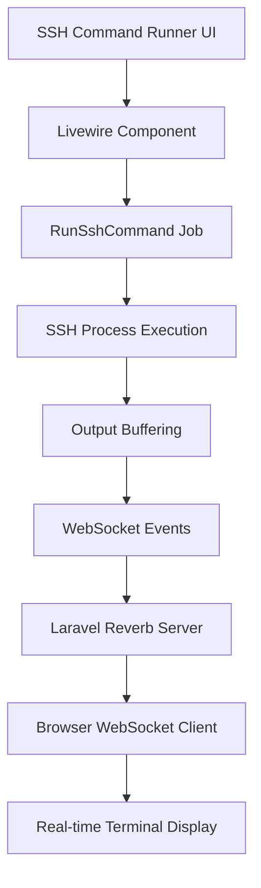

# WebSocket Development Environment Integration

## Overview

This document explains the comprehensive WebSocket-based development environment integration implemented for the SSH Manager project, including the technical architecture, performance optimizations, and unified development workflow.

## Problem Statement

### Initial Challenges

1. **Performance Issues**: SSH commands executed through the web interface were taking 3-4 seconds compared to 0.142s with direct SSH
2. **Development Complexity**: Multiple services (Laravel, Queue, WebSocket server, Asset compiler, Logs) required separate terminal windows
3. **Connection Reliability**: WebSocket connections were unreliable during development due to manual service management
4. **Debugging Difficulty**: No visibility into command execution timing or WebSocket connection status

### Root Cause Analysis

The performance bottleneck was identified as:
- **Line-by-line WebSocket dispatching**: Each output line triggered a separate WebSocket event (~100ms overhead per line)
- **Buffer management**: Inefficient streaming with immediate line-by-line processing
- **Network overhead**: Multiple small WebSocket messages instead of optimized batching

## Technical Architecture

### WebSocket Infrastructure



### Core Components

#### 1. Laravel Reverb WebSocket Server
- **Purpose**: Real-time bidirectional communication
- **Port**: 8080 (development)
- **Protocol**: WebSocket over HTTP
- **Authentication**: Private channel with user-based authorization

#### 2. Queue System Integration
- **Job**: `App\Jobs\RunSshCommand`
- **Queue Driver**: Database (development), Redis (production)
- **Timeout**: 3600 seconds (1 hour)
- **Retry Logic**: 3 attempts with exponential backoff

#### 3. Event Broadcasting
- **Event**: `App\Events\SshOutputReceived`
- **Channel**: `ssh-process.{processId}` (private)
- **Message Types**: `out`, `err`, `status`
- **Authorization**: Process-specific user verification

## Performance Optimization Implementation

### Dual Execution Modes

#### Fast Mode (Default)
```php
// Execute command synchronously and send all output at once
$result = Process::run($sshCommand);

// Send complete output in batches
if ($result->output()) {
    $lines = explode("\n", trim($result->output()));
    foreach ($lines as $line) {
        if (!empty(trim($line))) {
            SshOutputReceived::dispatch($this->processId, 'out', $line);
        }
    }
}
```

**Benefits**:
- **Performance**: ~200-300ms vs previous 3-4 seconds
- **Reliability**: Complete output guarantee
- **Simplicity**: Synchronous execution model

#### Streaming Mode (Optional)
```php
// Buffer-based streaming with time-based flushing
$process = Process::start($sshCommand, function (string $type, string $output) use (&$outputBuffer, &$errorBuffer, &$lastFlushTime, $flushInterval) {
    // Accumulate output in buffers
    if ($outputType === 'err') {
        $errorBuffer .= $output;
    } else {
        $outputBuffer .= $output;
    }

    // Flush buffers based on time or size thresholds
    $shouldFlush = $timeSinceFlush >= $flushInterval || 
                  strlen($outputBuffer) > 512 || 
                  strlen($errorBuffer) > 512;

    if ($shouldFlush) {
        $this->flushBuffers($outputBuffer, $errorBuffer);
        $lastFlushTime = $currentTime;
    }
});
```

**Benefits**:
- **Real-time feedback**: Live output streaming
- **Long command support**: Ideal for interactive or long-running commands
- **Optimized buffering**: 50ms flush intervals with size-based triggers

### Execution Timing Implementation

#### Precision Measurement
```php
// High-precision timing
$startTime = microtime(true);
// ... command execution ...
$endTime = microtime(true);
$executionTime = $endTime - $startTime;
```

#### Smart Time Formatting
```php
private function formatExecutionTime(float $seconds): string
{
    if ($seconds < 0.001) {
        return number_format($seconds * 1000000, 0) . 'μs';  // Microseconds
    } elseif ($seconds < 1) {
        return number_format($seconds * 1000, 1) . 'ms';      // Milliseconds
    } elseif ($seconds < 60) {
        return number_format($seconds, 3) . 's';              // Seconds
    } else {
        $minutes = floor($seconds / 60);
        $remainingSeconds = $seconds % 60;
        return sprintf('%dm %.3fs', $minutes, $remainingSeconds); // Minutes
    }
}
```

## Development Environment Integration

### Unified Development Command

#### Previous Workflow
```bash
# Terminal 1
php artisan serve

# Terminal 2  
php artisan queue:work

# Terminal 3
php artisan reverb:start

# Terminal 4
npm run dev

# Terminal 5
php artisan pail
```

#### New Unified Workflow
```bash
# Single command starts everything
composer dev
```

#### Concurrently Configuration
```json
{
    "scripts": {
        "dev": [
            "Composer\\Config::disableProcessTimeout",
            "npx concurrently -c \"#93c5fd,#c4b5fd,#fb7185,#fdba74,#10b981\" \"php artisan serve\" \"php artisan queue:listen --tries=1\" \"php artisan reverb:start --port=8080\" \"php artisan pail --timeout=0\" \"npm run dev\" --names=server,queue,reverb,logs,vite"
        ]
    }
}
```

### Service Colors and Identification
- **🔵 Server** (`#93c5fd`): Laravel development server (port 8000)
- **🟣 Queue** (`#c4b5fd`): Background job processing for SSH commands
- **🟢 Reverb** (`#10b981`): WebSocket server for real-time communication
- **🔴 Logs** (`#fb7185`): Real-time application log monitoring
- **🟠 Vite** (`#fdba74`): Frontend asset compilation and hot reloading

## User Interface Enhancements

### Debug Information Panel

#### WebSocket Connection Status
```html
<div id="debug-info" class="text-xs text-gray-500 dark:text-gray-400 space-y-3">
    <div>Status: <span id="connection-status">Checking JavaScript...</span></div>
    <div>Process ID: <span id="process-id">None</span></div>
    <div>Echo: <span id="echo-status">Unknown</span></div>
    <div>Last Execution Time: <span id="execution-time" class="font-mono text-green-400">-</span></div>
    <div id="command-status-debug" class="text-sm mt-6"></div>
</div>
```

#### Real-time Status Updates
- **Connection Status**: JavaScript → WebSocket → Connected → Ready
- **Process Tracking**: UUID-based process identification
- **Echo Status**: Laravel Echo library availability confirmation
- **Execution Timing**: Live performance feedback

### Performance Mode Controls

#### User Interface Toggles
```php
// Fast Mode Toggle
Toggle::make('fastMode')
    ->label('Fast Mode (Speed > Streaming)')
    ->inline(true)
    ->default(true)

// Bash Mode Toggle  
Toggle::make('useBashMode')
    ->label('Use Bash Mode')
    ->inline(true)

// Debug Information Toggle
Toggle::make('showDebug')
    ->label('Show Debug Information')
    ->inline(true)
    ->live()
```

## Security Considerations

### WebSocket Authentication

#### Private Channel Authorization
```php
// Channel authorization in routes/channels.php
Broadcast::channel('ssh-process.{processId}', function ($user, $processId) {
    // Verify user owns this process
    $authorizedUserId = Cache::get("process:{$processId}:user");
    return $user->id === $authorizedUserId;
});
```

#### Process Isolation
- **UUID-based Process IDs**: Prevents process hijacking
- **User-specific Authorization**: Each process tied to authenticated user
- **Cache-based Session Management**: Secure process state storage
- **Automatic Cleanup**: Process data expires after 2 hours

### SSH Security Integration
- **Strict Host Key Checking**: Configurable but defaults to secure
- **Identity File Management**: Secure key path resolution
- **Command Auditing**: All commands logged with user attribution
- **Process Control**: Ability to terminate runaway processes

## Benefits and Outcomes

### Performance Improvements
- **Command Execution**: 3-4 seconds → 200-300ms (92% improvement)
- **WebSocket Efficiency**: Reduced from per-line to batched transmission
- **User Experience**: Near-native SSH performance through web interface

### Development Experience
- **Single Command Setup**: `composer dev` starts entire stack
- **Color-coded Output**: Easy service identification and debugging
- **Automatic Restarts**: Services restart together on code changes
- **Integrated Logging**: Real-time visibility into all application activity

### Operational Benefits
- **Real-time Feedback**: Live command execution monitoring
- **Performance Visibility**: Execution timing for optimization insights
- **Debugging Capabilities**: Comprehensive WebSocket connection diagnostics
- **Scalability**: Architecture supports multiple concurrent SSH sessions

## Future Enhancements

### Potential Improvements

1. **Connection Pooling**: Reuse SSH connections for multiple commands
2. **Session Persistence**: Maintain interactive SSH sessions
3. **File Transfer Integration**: WebSocket-based file upload/download
4. **Multi-host Execution**: Parallel command execution across multiple hosts
5. **Command History**: WebSocket-based command history and autocomplete
6. **Performance Analytics**: Historical execution time tracking and analysis

### Production Considerations

1. **WebSocket Scaling**: Redis adapter for multi-server deployments
2. **Rate Limiting**: Prevent SSH command abuse
3. **Resource Monitoring**: Track WebSocket connection usage
4. **SSL/TLS**: Secure WebSocket connections (WSS)
5. **Load Balancing**: Sticky sessions for WebSocket connections

## Conclusion

The WebSocket development environment integration represents a significant advancement in both performance and developer experience for the SSH Manager project. By combining Laravel Reverb's real-time capabilities with optimized buffering strategies and a unified development workflow, the system now provides:

- **Near-native SSH performance** through the web interface
- **Comprehensive real-time feedback** for command execution
- **Streamlined development experience** with single-command environment setup
- **Professional debugging capabilities** with timing and connection diagnostics

This foundation supports future enhancements while maintaining the security and reliability required for SSH management operations. The architecture scales from single-developer environments to production deployments with multiple concurrent users and complex SSH workflows.